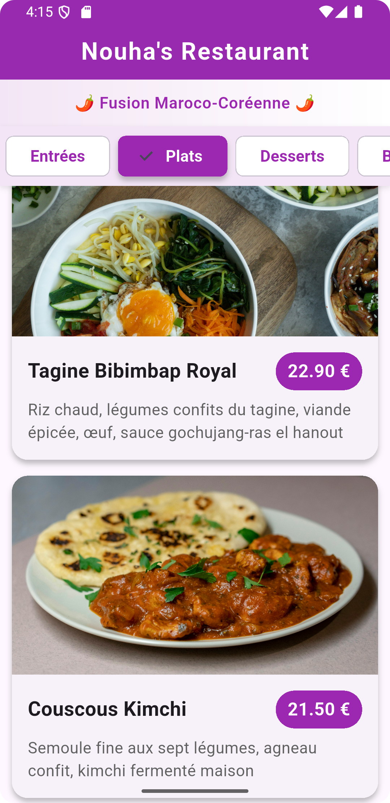

# 🍜 Nouha's Restaurant - Application Menu

Application mobile Flutter présentant le menu d'un restaurant de cuisine fusion maroco-coréenne.


## 📱 Aperçu

Application de menu restaurant développée en Flutter présentant une cuisine fusion innovante mêlant traditions marocaines et coréennes.

### ✨ Fonctionnalités

- ✅ **Navigation par catégories** : Formules, Entrées, Plats, Desserts, Boissons
- ✅ **Scroll horizontal** pour la barre de catégories
- ✅ **Scroll vertical** pour la liste des plats
- ✅ **Cartes visuelles** pour chaque plat avec :
    - Image représentative
    - Nom du plat
    - Description détaillée
    - Prix
- ✅ **Design responsive** adapté aux smartphones
- ✅ **Thème cohérent** en violet (purple)

## 🎯 Objectifs du projet

Projet réalisé dans le cadre d'un TD Flutter sur les Layouts & Scrolls :
- Maîtriser les widgets de layout (Column, Row, Expanded, Card)
- Gérer l'affichage scrollable (ListView, ListView.builder)
- Créer des composants UI réutilisables
- Structurer une interface hiérarchisée

## 🛠️ Technologies utilisées

- **Flutter** : Framework de développement multiplateforme
- **Dart** : Langage de programmation
- **Material Design 3** : Design system

## 📦 Structure du projet
```
menu_restaurant/
├── lib/
│   └── main.dart          # Code principal de l'application
├── pubspec.yaml           # Configuration et dépendances
├── README.md              # Documentation
└── .gitignore             # Fichiers à ignorer
```

## 🚀 Installation et lancement

### Prérequis

- Flutter SDK installé ([Guide d'installation](https://flutter.dev/docs/get-started/install))
- Android Studio ou VS Code avec extensions Flutter/Dart
- Un émulateur Android/iOS ou un appareil physique

### Étapes

1. **Cloner le repository**
```bash
   git clone https://github.com/Nouhamk/menu_restaurant.git
   cd menu_restaurant 
```

2. **Installer les dépendances**
```bash
   flutter pub get
```

3. **Lancer l'application**
```bash
   flutter run
```

## 🍽️ Menu

### Catégories disponibles :

- **Formules** : Menus complets à prix avantageux
- **Entrées** : Kimchi Zaalouk, Briouates au Bulgogi, Salade Harira-Bibimbap...
- **Plats** : Tagine Bibimbap Royal, Couscous Kimchi, Kefta Tteokbokki...
- **Desserts** : Bingsu aux dattes, Chebakia au Sésame noir, Hotteok...
- **Boissons** : Thé à la menthe-Yuzu, Sikhye à la rose, Café épicé...

## 🎨 Architecture du code

### Modèle de données
```dart
class Plat {
  final String nom;
  final String description;
  final double prix;
  final String imageUrl;
  final String categorie;
}
```

### Widgets principaux

- `MenuRestaurantApp` : Point d'entrée de l'application
- `RestaurantMenuPage` : Page principale avec gestion d'état
- `PlatCard` : Widget réutilisable pour afficher un plat

### Concepts Flutter utilisés

- **StatefulWidget** pour la gestion d'état
- **ListView.builder** pour les listes performantes
- **Column & Row** pour l'organisation des layouts
- **ChoiceChip** pour la sélection de catégories
- **Card** pour l'affichage des plats
- **Image.network** avec gestion d'erreur et loading

## 📱 Aperçu

Voici un aperçu du rendu de l’application :



Application de menu restaurant développée en Flutter présentant une cuisine fusion innovante mêlant traditions marocaines et coréennes.

## 👨‍💻 Auteur

**Nouhaila Moukaddime** - Projet académique Flutter

## 📄 Licence

Ce projet est réalisé dans un cadre éducatif.

## 🙏 Remerciements

- Images : [Unsplash](https://unsplash.com)
- Framework : [Flutter](https://flutter.dev)
- Inspiration : Fusion culinaire Maroc-Corée
